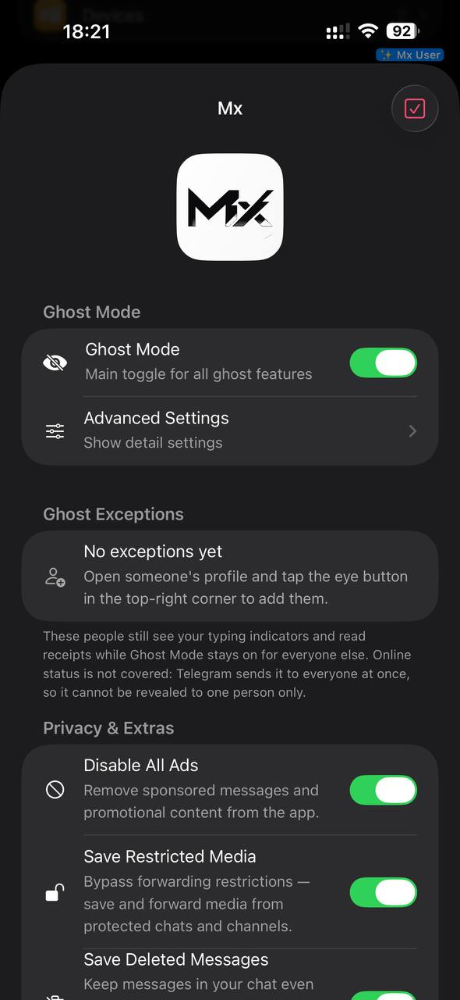
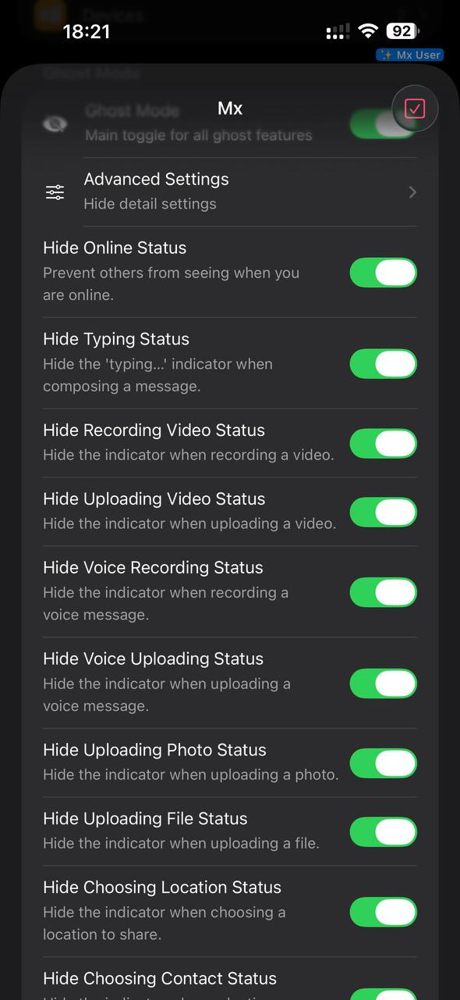
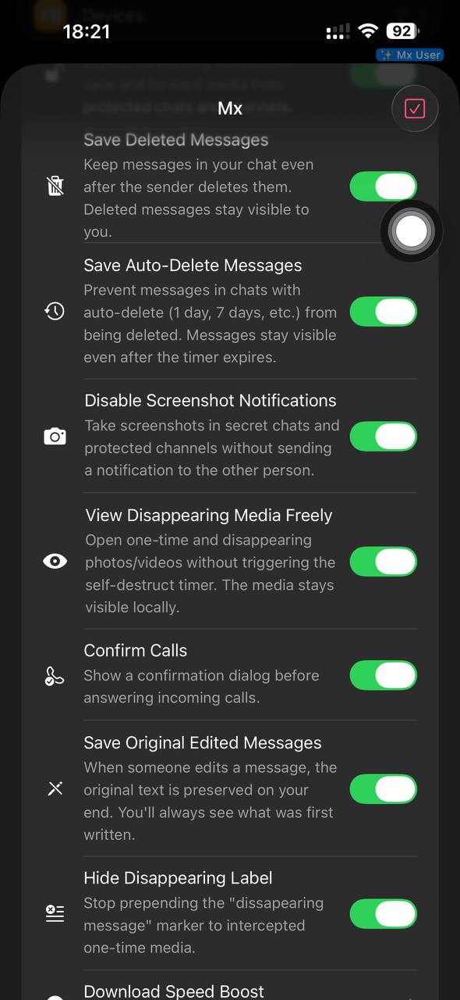
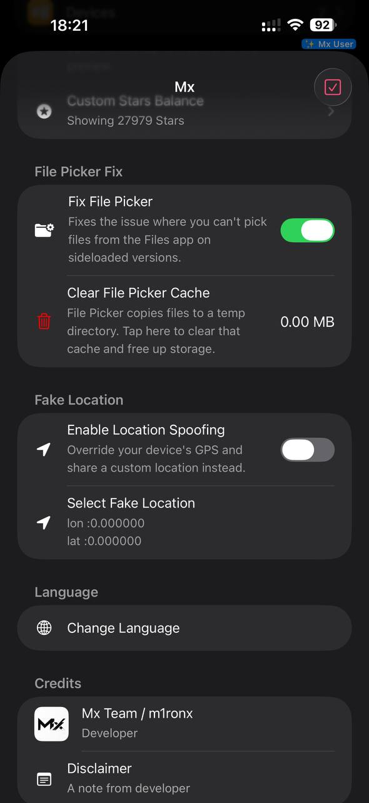
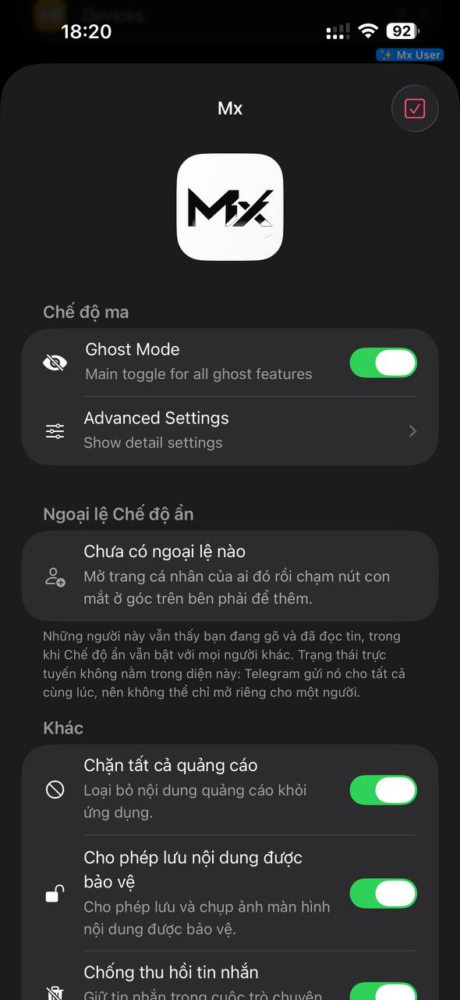

<p align="center">
  
</p>

<h1 align="center">Mx</h1>

<p align="center">
  Tweak quyền riêng tư & tiện ích cho Telegram trên iOS, giao diện liền mạch như native.
</p>

<p align="center">
  <a href="README.md">English</a> ·
  <b>Tiếng Việt</b> ·
  <a href="README.zh.md">简体中文</a>
</p>

<p align="center">
  
  
  
  
</p>

---

## Bắt đầu

Cài file `.deb` (máy đã jailbreak) hoặc sideload bản IPA đã patch, rồi mở Telegram.

> **Mở menu Mx:** nhấn giữ dòng **"Ask a Question"** (Đặt câu hỏi) trong phần Cài đặt của Telegram.

## Tính năng

### 👻 Chế độ ma (Ghost Mode)

Một công tắc tổng ẩn mọi trạng thái hoạt động bạn gửi đi. Tinh chỉnh từng mục trong **Advanced Settings**.

| Tính năng | Tác dụng |
|---|---|
| Ẩn trạng thái trực tuyến | Người khác không thấy bạn đang online |
| Ẩn trạng thái đang gõ | Không hiện `đang nhập…` khi bạn soạn tin |
| Ẩn quay / tải video | Ẩn cả trạng thái đang quay lẫn đang tải video lên |
| Ẩn ghi âm / tải tin nhắn thoại | Tương tự với tin nhắn thoại |
| Ẩn quay / tải video tròn | Tương tự với tin nhắn video tròn |
| Ẩn tải ảnh / tệp | Không hiện trạng thái khi gửi ảnh hoặc tệp |
| Ẩn chọn vị trí / danh bạ / nhãn dán | Không hiện trạng thái khi bạn đang chọn nội dung chia sẻ |
| Ẩn trạng thái chơi game | Không hiện trạng thái với game inline |
| Ẩn nói trong cuộc gọi nhóm | Trạng thái đang nói của bạn được giấu trong group call |
| Ẩn tương tác / thả cảm xúc emoji | Không hiện trạng thái khi bạn tương tác hoặc thả emoji |
| Tắt báo đã đọc tin nhắn | Người khác không biết bạn đã đọc tin của họ |
| Tắt báo đã xem story | Người khác không biết bạn đã xem story của họ |

**Ngoại lệ Chế độ ẩn** — mở trang cá nhân của ai đó rồi chạm nút con mắt ở góc trên bên phải để thêm vào danh sách trắng. Những người này vẫn thấy bạn đang gõ và đã đọc tin, trong khi Chế độ ẩn vẫn bật với mọi người khác.

> Trạng thái trực tuyến **không** nằm trong diện ngoại lệ: Telegram gửi nó cho tất cả cùng lúc, nên không thể chỉ mở riêng cho một người.

### 🔒 Quyền riêng tư & Tiện ích

| Tính năng | Tác dụng |
|---|---|
| Chặn tất cả quảng cáo | Loại bỏ tin nhắn tài trợ và nội dung quảng bá |
| Lưu nội dung được bảo vệ | Vượt giới hạn chuyển tiếp — lưu và chuyển tiếp media từ kênh, đoạn chat bị khoá |
| Chống thu hồi tin nhắn | Tin nhắn vẫn còn trong đoạn chat sau khi người gửi xoá |
| Chống tự động xoá | Tin nhắn sống sót qua bộ đếm tự xoá (1 ngày, 7 ngày, …) |
| Tắt thông báo chụp màn hình | Chụp màn hình chat bí mật và kênh được bảo vệ mà không báo cho đối phương |
| Xem thoải mái media biến mất | Mở ảnh/video xem một lần mà không kích hoạt bộ đếm tự huỷ |
| Giữ nội dung gốc khi bị sửa | Giữ lại văn bản ban đầu khi ai đó chỉnh sửa tin nhắn |
| Ẩn nhãn tin nhắn biến mất | Bỏ nhãn "tin nhắn biến mất" khỏi media một lần đã chặn được |
| Xác nhận cuộc gọi | Hộp thoại xác nhận trước khi nhận cuộc gọi đến |
| Tăng tốc tải xuống | Chunk lớn hơn và nhiều kết nối song song hơn — mức Medium hợp với đa số |
| Tuỳ chỉnh số dư Stars | Chỉ hiển thị; máy chủ vẫn giữ số dư thật của nó |
| Video sang tin nhắn thoại | Gửi riêng phần tiếng của video dưới dạng tin nhắn thoại thật, tôn trọng đoạn đã cắt trong preview |

### 🛠 Công cụ

- **Sửa lỗi chọn tệp** — khắc phục việc không chọn được tệp từ app Files trên bản sideload. **Xoá cache chọn tệp** dọn các bản sao tạm mà nó để lại.
- **Vị trí giả** — ghi đè GPS của máy và chia sẻ toạ độ tự đặt.
- **Lịch sử chỉnh sửa** — xem lại mọi phiên bản của một tin nhắn đã bị sửa.

### 🌍 Ngôn ngữ

10 ngôn ngữ tích hợp sẵn, đổi ngay trong app tại **Language → Change Language**:

Ả Rập · Trung giản thể · Trung phồn thể · Anh · Tây Ban Nha · Pháp · Ý · Nhật · Nga · Việt

## Ảnh chụp màn hình

<p align="center">
  
  
  
</p>
<p align="center">
  
  
</p>

## Build

Cần [Theos](https://theos.dev) kèm SDK iOS 16.5.

```bash
make package          # build Mx.dylib và file .deb
```

File `.dylib` cũng được chép sang `packages/Mx.dylib` để sideload trực tiếp.

Sau khi sửa bất kỳ `Mx.bundle/*.lproj/Localizable.strings` nào, sinh lại bản dịch nhúng bằng:

```bash
python3 generate_langs.py
```

## Tương thích

- iOS 14.0 trở lên, `arm64` và `arm64e`
- Chạy được trên Telegram chính thức và các bản fork như iMe

Một số tính năng phụ thuộc vào API layer mà app chủ đang dùng. **Giữ nội dung gốc khi bị sửa** sẽ hiện ghi chú "không khả dụng" nếu layer của bản Telegram đó quá cũ để nhận được cập nhật chỉnh sửa.

## Miễn trừ trách nhiệm

Đây là **bản chỉnh sửa (tweak) độc lập** cho ứng dụng Telegram. Dự án **không liên kết, không liên quan, không được uỷ quyền hay chứng thực và không có quan hệ chính thức nào với Telegram Messenger LLP** hoặc bất kỳ công ty con, chi nhánh nào của họ. Mọi nhãn hiệu, bao gồm tên và logo Telegram, thuộc về chủ sở hữu tương ứng.

Tweak này chỉ dành cho **mục đích cá nhân và học tập**. Dùng thì tự chịu rủi ro. Đừng dùng để phá luật hay vi phạm điều khoản dịch vụ của Telegram — tác giả không chịu trách nhiệm cho bất kỳ sự cố, thiệt hại hay hậu quả nào phát sinh từ việc sử dụng hoặc lạm dụng.

## Ghi công

Dự án này là bản fork của [Aj3radi/TGExtra](https://github.com/Aj3radi/TGExtra).

---

<p align="center">
  📢 Kênh Telegram: <a href="https://t.me/m1ronx">t.me/m1ronx</a>
</p>
